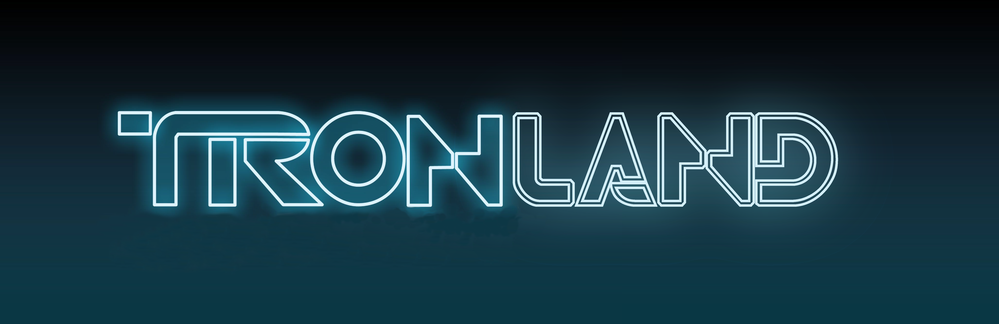

# Tronland

## Instructions

To develop the project, the following libraries have been used: FreeGlut, Glew, SOIL, SDL and SDL-mixer, to make sure it will work, we have to install:  

<em>sudo apt-get update</em> 
<em>sudo apt install freeglut3-dev</em> 
<em>sudo apt install libglew-dev</em> 
<em>sudo apt install libsoil-dev</em> 
<em>sudo apt install libsdl1.2-dev</em> 
<em>sudo apt install libsdl-image1.2-dev</em> 
<em>sudo apt install libsdl-mixer1.2-dev</em> 
<em>sudo apt install libsdl-ttf2.0-dev</em> 

or 

<em>sudo apt install freeglut3-dev libglew-dev libsoil-dev libsdl1.2-dev libsdl-image1.2-dev libsdl-mixer1.2-dev libsdl-ttf2.0-dev</em> 

To compile and run the program, just go into the MakeFile paste and then execute the command "make run" in the terminal.

## Comands
### Menu
[w] [s] -> switch between buttons 
[enter] -> select 
[esc] -> exit the game 

### Game
[1] [2] [3] -> switch between cameras 
[w] [a] [s] [d] -> walk in world and change camera position 
[q] [e] ->  control height of camera 1 
[mouse] -> control view of camera 1 
[l] -> turn on/off lightining 
[n] -> turn on/off fog 
[p] -> pause rides movement 
[esc] -> exit the game 
